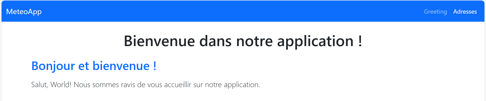
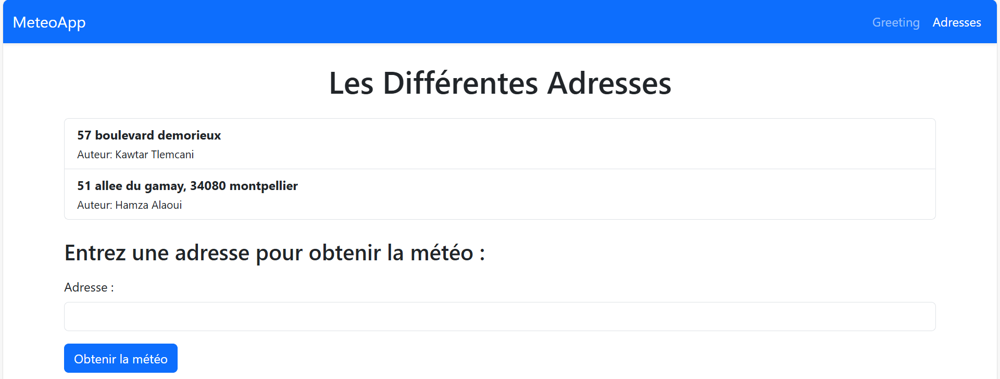
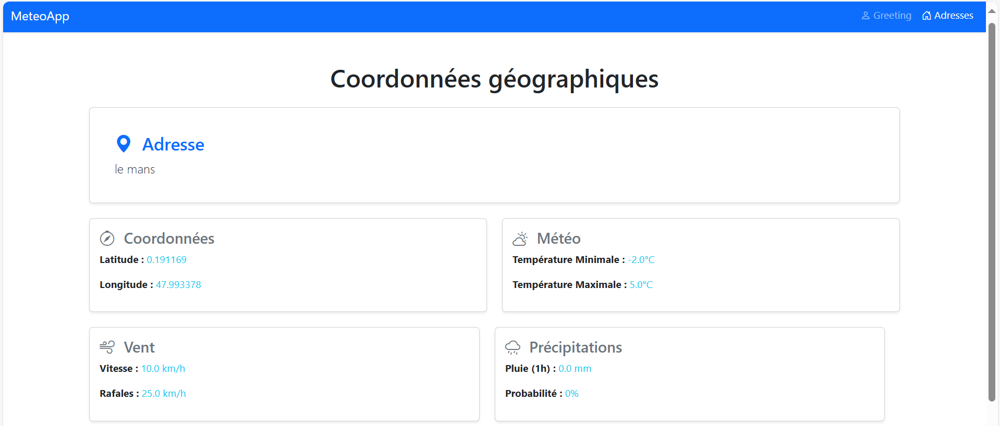

# lien github

https://github.com/kawtarTL/springBootApp

# Remarque
```xml
http.proxyHost=proxy.univ-lemans.fr
http.proxyPort=3128
https.proxyHost=proxy.univ-lemans.fr
https.proxyPort=3128
```
# ET dans pom.xml ajouter CA 
```xml
<configuration>
  <jvmArguments>
    -Dhttp.proxyHost=proxy.univ-lemans.fr
    -Dhttp.proxyPort=3128
    -Dhttps.proxyHost=proxy.univ-lemans.fr
    -Dhttps.proxyPort=3128
  </jvmArguments>
</configuration>
```


# Description des dépendances

1. Spring Web : Permet de créer des app web en utilisant le framework Spring.
2. Spring Data JPA : Simplifie l'utilisation de JPA pour l'accès aux données.
3. Hibernate : Framework ORM pour mapper des objets Java sur des tables de bases de données.
4. H2 Database : Base de données en mémoire utilisée pour le développement et les tests.
5. Spring DevTools : Outils de développement qui permettent un rechargement automatique des classes.
6. Thymeleaf : Moteur de templates pour générer des pages HTML dynamiques.

## Réponses - Étape 13

1. Paramétrage de l'URL `/greeting` : 
   Utilisation de l'annotation `@GetMapping("/greeting")` dans la classe du controller.

2. Choix du fichier HTML à afficher : 
   La méthode du controller retourne une chaîne correspondant au nom du fichier `.html` dans le dossier `src/main/resources/templates`.

3. **Envoi du nom à la vue :**  
   Utilisation de l'annotation `@RequestParam` pour récupérer un paramètre de requête, et ajout de ce paramètre au modèle avec `model.addAttribute`. La vue peut ensuite accéder à ce paramètre via Thymeleaf.

## Réponses - Étape 17

Une nouvelle table ADDRESS est apparue dans la console H2. Cela se produit parce que Hibernate, configuré avec Spring Boot, détecte les classes annotées avec @Entity et génère automatiquement des tables correspondantes dans la base de données.

## Réponses - Étape 18

La table ADDRESS a été générée automatiquement grâce à Hibernate. Hibernate utilise les annotations JPA pour créer une structure de table correspondant aux champs de la classe Address. Spring Boot configure automatiquement Hibernate avec une base de données en mémoire (H2) pour simplifier le développement.

## Réponses - Étape 20

En exécutant une requête SELECT * FROM ADDRESS, nous voyons les deux enregistrements définis dans le fichier data.sql. Spring Boot charge automatiquement ce fichier au démarrage pour insérer les données dans la base.

## Réponses - Étape 22

L'annotation @Autowired est utilisée pour l'injection de dépendances. Elle permet à Spring Boot de gérer automatiquement la création et l'initialisation des objets nécessaires, comme AddressRepository dans ce cas.

### Réponses - Étape 30

Pour ajouter Bootstrap au projet Spring Boot via un CDN, procédez comme suit :

1. Ouvrez le fichier `application.properties` de votre projet.
2. Définir le lien CDN de Bootstrap.

## Étape 6 : Réponses aux questions sur l'API MeteoConcept

#### Faut-il une clé API pour appeler MeteoConcept ?
Oui, une clé API est nécessaire pour chaque appel à l'API. Elle doit être incluse dans l'URL en tant que paramètre `token`.

#### Quelle URL appeler ?
- Pour récupérer les éphémérides (lever et coucher du soleil, phase lunaire) :

https://api.meteo-concept.com/api/ephemeride/0?token=CLE_API

bash
Copier le code
- Pour les prévisions météo journalières :
  https://api.meteo-concept.com/api/forecast/daily?token=CLE_API

markdown
Copier le code

#### Quelle méthode HTTP utiliser ?
La méthode HTTP utilisée est `GET`.

#### Comment passer les paramètres d'appels ?
Les paramètres doivent être ajoutés à l'URL sous forme de chaîne de requête :
- `token` : Clé API pour l'authentification.
- `day` : (optionnel) Permet de spécifier le jour visé (exemple : `0` pour aujourd'hui, `1` pour demain).
- `lat` et `lon` : (optionnel) Coordonnées GPS du lieu visé. Si elles ne sont pas spécifiées, la localisation par défaut du compte est utilisée.

Exemple d'URL avec des paramètres :
https://api.meteo-concept.com/api/forecast/daily?token=CLE_API&lat=48.112&lon=-1.6819


#### Où est l'information dont j'ai besoin dans la réponse ?
- **Pour afficher la température du lieu visé par les coordonnées GPS** :
  Les informations de température minimale et maximale se trouvent dans les nœuds `tmin` et `tmax` de la réponse obtenue depuis l'endpoint `/forecast/daily`.

  Exemple de structure XML :
  <response>
      <forecast>
          <day>0</day>
          <datetime>2025-01-09</datetime>
          <tmin>-1</tmin>
          <tmax>7</tmax>
      </forecast>
  </response>
Pour afficher la prévision de météo du lieu visé par les coordonnées GPS : La prévision météorologique est contenue dans les nœuds weather et probarain :

weather : Code représentant l'état du ciel.
probarain : Probabilité de pluie en pourcentage.
Exemple de structure XML :

<response>
   <forecast>
      <day>0</day>
      <datetime>2025-01-09</datetime>
      <weather>12</weather>
      <probarain>45</probarain>
   </forecast>
</response>




